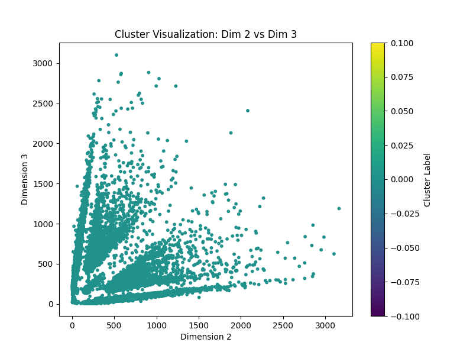
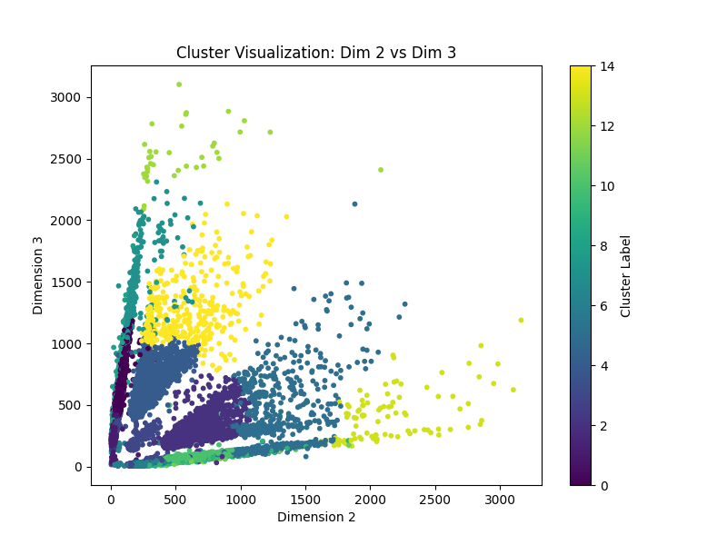

# Big Data Final Project Report

- **Student ID**: r13922044  
- **Date**: June 3, 2025  
- **GitHub Repository**: <https://github.com/Shiritai/big-data-final>

## Introduction

This report details the clustering approach for the Big Data final project, analyzing particle accelerator datasets to identify $4n-1$ clusters (15 for the 4-dimensional public dataset and 23 for the 6-dimensional private dataset). The Fowlkes-Mallows Index (FMI) evaluates clustering accuracy against a hidden ground truth. I implemented multiple clustering methods, enhanced by visualization and preprocessing, achieving a strong FMI score of 0.9263 on the public dataset using Hierarchical Clustering.

## Setup and execution

### Setup

```bash
conda create --name bd_final python=3.10
conda activate bd_final
pip3 install pandas scikit-learn joblib tqdm
```

### Execution

```bash
conda activate bd_final
# Compute and generate r13922044_{public,private}.csv
# and {public,private}_submission.csv
python3 main.py
```

## Task Fulfillment

### Clustering Algorithm

I employed four unsupervised clustering methods to group the data into $4n-1$ clusters:

- **K-Means**: Minimizes intra-cluster variance with 100 initializations, 500 max iterations, and $10^{-5}$ tolerance.
- **Gaussian Mixture Model (GMM)**: Models data as Gaussian mixtures, using tied covariance and K-Means initialization.
- **Hierarchical Clustering**: Uses Ward linkage and Euclidean distance, with sampling (10,000 points) for large datasets and nearest-neighbor label propagation.
- **Hybrid Clustering**: Performs K-Means on dimensions 2 and 3 (5 clusters, per the hint), followed by hierarchical clustering on all dimensions.

Multiple seeds were tested, and the best method (Hierarchical Clustering, FMI 0.9263, seed 18287) was selected for the public dataset and applied to the private dataset.

## Technical Execution and Creativity

### Suitability for the Dataset

Hierarchical Clustering with Ward linkage proved most effective, achieving an FMI score of 0.9263 on the public dataset (49771 points). The specification hints at 5 distinct clusters in dimensions 2 and 3, suggesting structured relationships in physical data. Ward linkage minimizes intra-cluster variance, adeptly capturing such structures. The Hybrid Clustering approach creatively leverages this hint by initially clustering dimensions 2 and 3, though Hierarchical Clustering alone outperformed it, likely due to its robustness across all dimensions. Multiple seeds ensured optimal performance.

### Preprocessing

- **Missing Values**: Imputed with feature means using `SimpleImputer`.
- **Standardization**: Applied `StandardScaler` to normalize feature scales, critical for distance-based methods like Hierarchical Clustering.

### Hyperparameters

- **Clusters**: 15 for public dataset, 23 for private dataset ($4n-1$).
- **Hierarchical Clustering**: Ward linkage, Euclidean metric, sampling at 10,000 points for large datasets (e.g., 200000 points in private data).
- **Seeds**: Tested [21, 3347, 7499, 8161, 9551, 10331, 15263, 17047, 18181, 18287, 18481]; best seed 18287.
- **Other Settings**: K-Means (100 init, 500 max iter), GMM (tied covariance, 300 max iter), Hybrid (K-Means on dims 2 and 3, 5 clusters).

### Assumptions

- Data has structured clusters, with 5 visible groups in dimensions 2 and 3.
- Public and private datasets share similar physical characteristics, justifying the same method.
- Minor noise exists, handled by standardization and robust clustering.

## Result

### Visualization and Analysis

I visualized dimension pairs, focusing on dimensions 2 and 3 as per the hint. The initial scatter plot (`plots/dim_2_vs_3_initial.png`) of raw (standardized) data revealed potential cluster structures in the public dataset (49771 points).



The best result plot (`plots/dim_2_vs_3_hierarchical_clustering_best.png`) for Hierarchical Clustering (FMI 0.9263, seed 18287) showed well-separated clusters, with 5 groups apparent in dimensions 2 and 3, aligning with the hint. This validates the approach, as the structure likely extends to the private dataset (200000 points).



### Pipeline

1. **Load Data**: Read public (4D, 49771 points) and private (6D, 200000 points) datasets.
2. **Preprocess**: Impute missing values, standardize features.
3. **Visualize**: Plot dimensions 2 vs. 3 to explore structure.
4. **Cluster**: Test K-Means, GMM, Hierarchical, and Hybrid methods across seeds.
5. **Evaluate**: Select best method/seed via FMI on public dataset.
6. **Apply**: Use best method for private dataset, save results.
7. **Visualize Results**: Plot best clustering for dimensions 2 and 3.

### Why Effective?

Hierarchical Clustering excels due to its ability to capture non-spherical, hierarchical structures in physical data. Preprocessing (imputation, standardization) ensures robustness, while sampling handles large datasets (e.g., 200000 points). Testing multiple seeds optimized the FMI score (0.9263). Visualization confirmed the hint of 5 clusters in dimensions 2 and 3, enhancing confidence in the approach.

### Handling High-Dimensional Data

The 4D and 6D datasets are manageable with standardization to balance feature contributions. Hierarchical Clustering uses Euclidean distance, effective in low-to-moderate dimensions. For large datasets, sampling (10,000 points) and nearest-neighbor propagation reduce computational cost, maintaining accuracy across 49771 and 200000 points.

## Conclusion

Hierarchical Clustering with Ward linkage effectively grouped the particle accelerator data into $4n-1$ clusters, achieving an FMI score of 0.9263 on the public dataset. Visualization of dimensions 2 and 3 confirmed structured clusters, supporting the approach for both datasets. The solution is robust and optimized via preprocessing and seed testing. Code is available at: <https://github.com/Shiritai/big-data-final>.
